# BarberHub - Sistema de Gerenciamento de Agendamentos para Barbearias  

Consiste em um sistema desktop dedicado ao gerenciamento dos agendamentos de clientes em uma barbearia. Este sistema oferece diversas funcionalidades para facilitar a administração, proporcionando maior controle e eficiência.

O sistema permite:  
- Criar agendamentos;
  
- Editar e Excluir os agendamentos feitos;
  
- Finalizar os agendamentos marcados;
  
- Cadastrar novos clientes;
    
- Editar e Excluir os dados dos clientes;
  
- Adicionar novos serviços prestados pelo barbeiro;    

- Editar e Excluir serviços;    

- Cadastrar usuários(barbeiros);    

- Editar e Excluir usuários.    

 <strong> Ao final do ReadMe irei incluir algumas observações que fiz durante o desenvolvimento do projeto. 

## Organização do código    

 O sistema é organizado seguindo o padrão arquitetural Model-View-Controller (MVC), proporcionando uma estrutura clara e modularizada para as finalidades do sistema. Seguir esse padrão me auxiliou muito ao decorrer do desenvolvimento do projeto, pois ela torna o codigo mais organizado e manutenivel.   

 - DAO: Responsável pela interação com o banco de dados, além de também isolar a lógica de acesso a dados do restante do sistema.  

- Model: Contém as classes que representam os objetos de negócios, como Clientes, Agendamento, entre outros.  

- View: Responsável pela apresentação e interação com o usuário.   

- Controller: Gerencia a lógica de negócios e atua como intermediário entre as Views e os Models. Recebe comandos do usuário, manipula os dados, e atualiza a interface de acordo.  

- Helper: Contém classes ou métodos utilitários que auxiliam os controllers em suas funções, pois inclui funcionalidades, como validações, conversões, entre outras.  

## Tecnologias  utilizadas    

 - Java;  

- JPA/Hibernate;    

- Postgresql;   

- Java Swing;   

- IDE Netbeans (Escolhida por tornar a criação das interfaces graficas mais simples e dinamicas);  

## Diagrama de classes do projeto 
O projeto foi desenvolvido com base no modelo de classes projetado, o que proporcionou uma compreensão global da arquitetura do sistema.

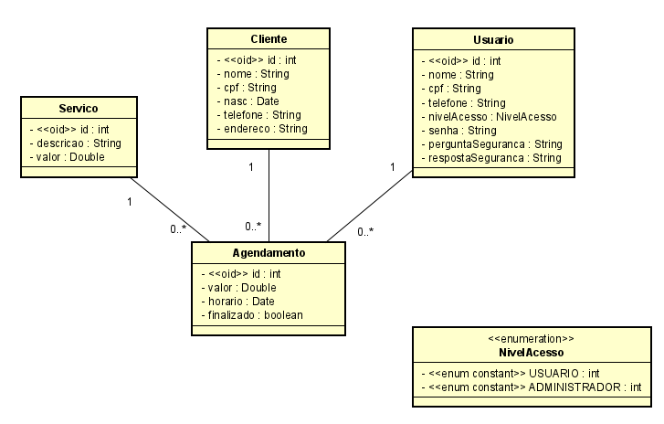

---
# Imagens do sistema     

Irei compartilhar e descrever algumas capturas de tela que oferecem uma visão detalhada das funcionalidades e interface do sistema.

## Login  
A tela de login permite que o usuário que está cadastrado no sistema, efetue o login com a sua senha. O sistema também oferece a opção de visualizar a senha durante o processo de login.

Em situações em que o usuário esquece a senha, é possível recuperar o acesso por meio da pergunta de segurança. Esse campo exibe a pergunta de recuperação associada ao usuário selecionado durante o login.

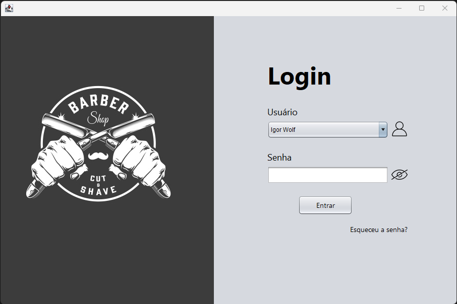

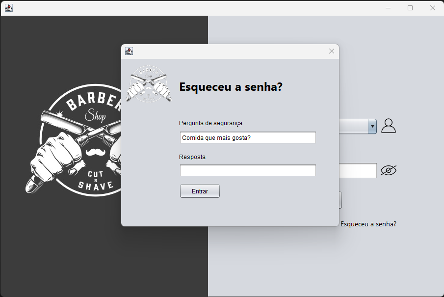

## Menu    
O painel de menu exibe de forma organizada as diversas funcionalidades disponíveis no sistema, proporcionando uma navegação intuitiva. Também é apresentado uma barra com informações na parte inferior, onde é exibido o logo do estabelecimento, a data atual, o nome do usuário logado, seu nível de acesso e um botão de logout para uma transição fácil de volta à tela de login. Essa barra estará presente em todas as atividades do usuário no sistema.

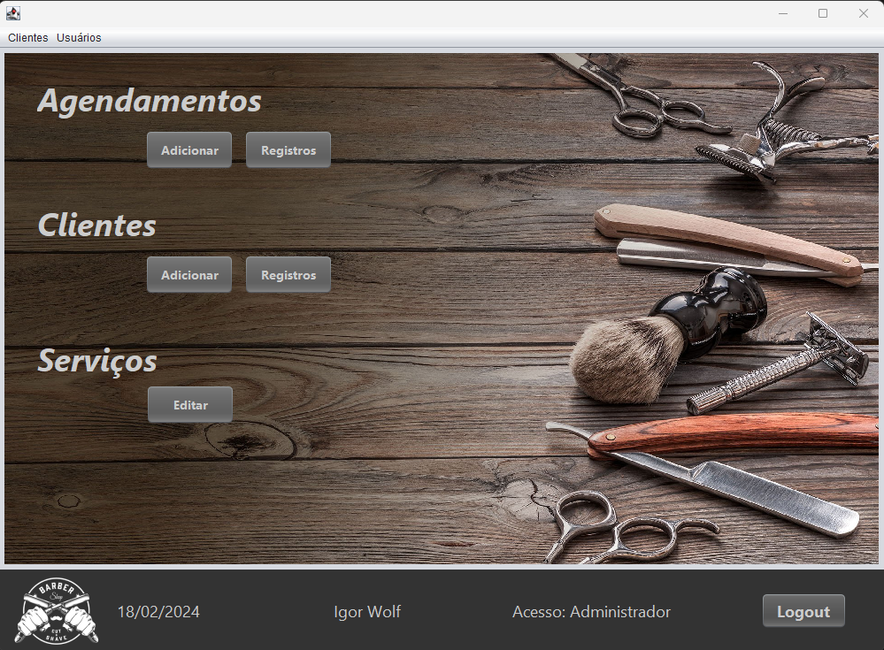 

## Agendamentos 
Na tela de agendamentos, na opção de registros, é possível visualizar todos os agendamentos feitos pelo barbeiro. O botão "Todos os Agendamentos" exibe todas as marcações realizadas por todos os barbeiros.

Ao clicar em um agendamento na tabela, o sistema preenche automaticamente os campos com as informações correspondentes. Após realizar alterações nos campos desejados e selecionar o botão "Atualizar", o sistema efetua a atualização das informações do agendamento, aplicando as verificações necessárias.

O botão "Finalizar Agendamento" é responsável por concluir um agendamento, alterando o status dele para "Finalizado".

Caso a opção seja deletar, ao selecionar o botão "Deletar", o sistema remove o agendamento selecionado.

**Observação:** *Não é possivel deletar os agendamentos feitos por outros usuários.*

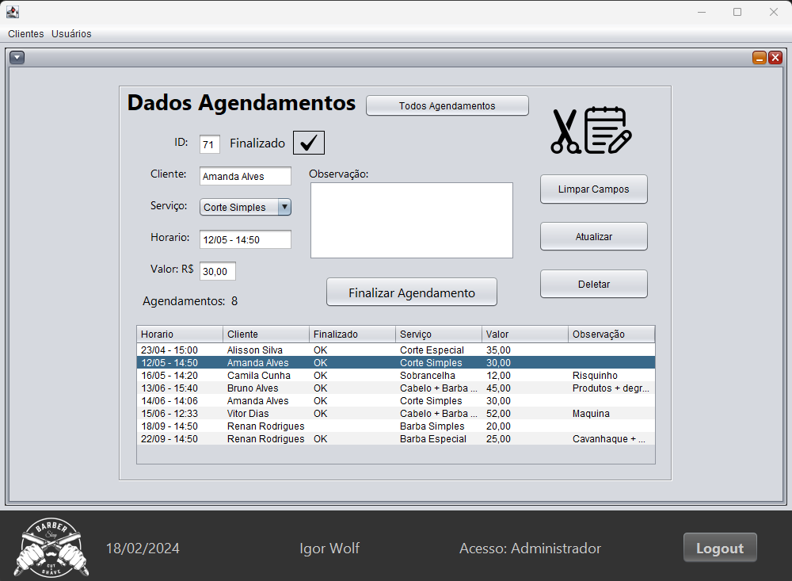

## Clientes   
A tela referente aos dados dos clientes é bastante semelhante aos registros dos agendamentos, porém foi implementada uma lógica de pesquisa dinâmica. Ao digitar o nome do cliente, a tabela é automaticamente atualizada com os resultados correspondentes à sequência de letras inserida.

O botão "Atualizar" permite a modificação dos dados do cliente, aplicando as verificações necessárias para garantir a consistência das informações.

**Observação:** O botão de deletar está disponível apenas para *usuários com nível de acesso Administrador*; para usuários comuns, ao clicar no botão é exibido uma mensagem de acesso negado.

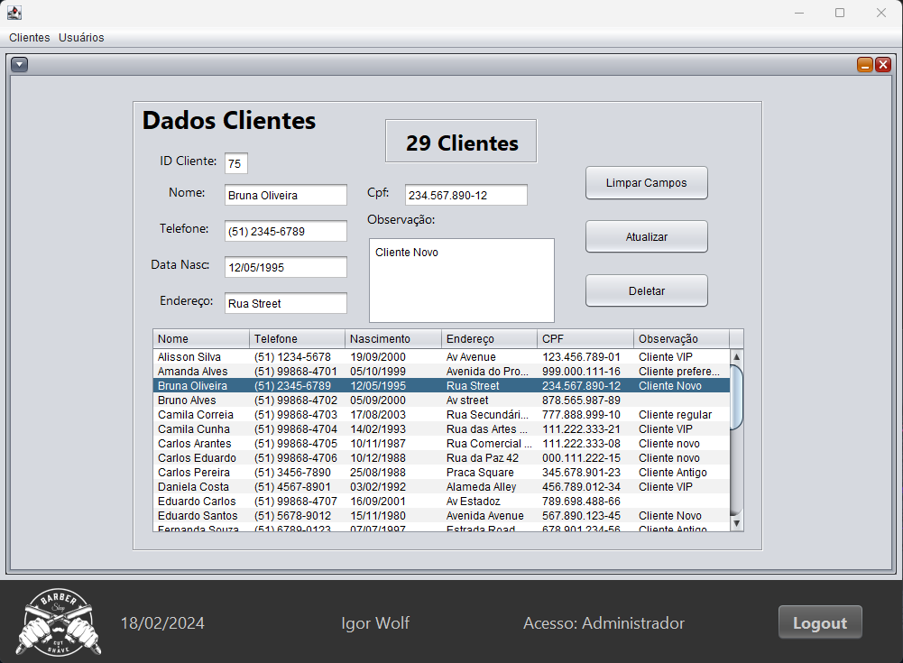

## Serviços 
Na tela de serviços, é possivel gerenciar os serviços prestados pelo profissional.

Ao selecionar o serviço desejado, é possível editar o valor padrão do serviço ou excluí-lo.

Também é possível criar um novo serviço, definindo o nome e o valor padrão do mesmo.

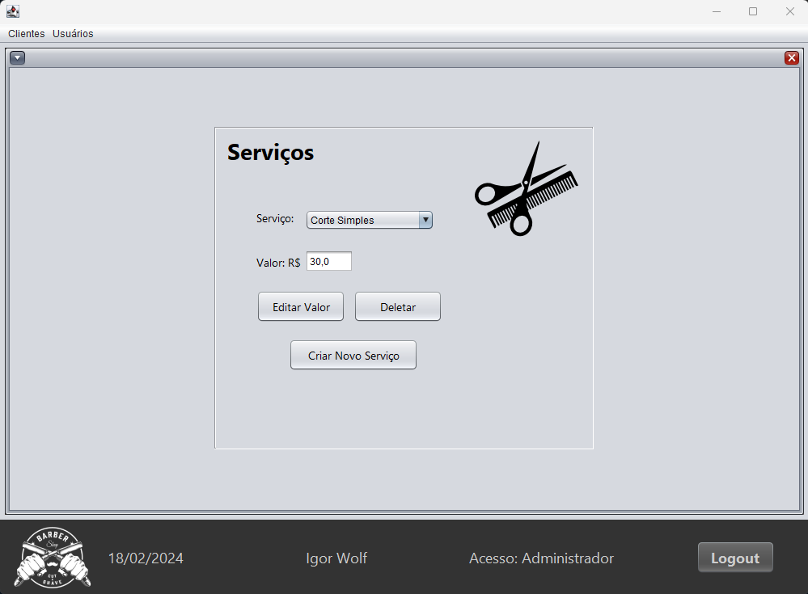)

## Usuários (Barbeiros)

A tela de Usuários permite o gerenciamento dos perfis dos usuários (barbeiros). 

Na tela de "Editar Usuários", é possível atualizar os dados do usuário, incluindo senha, pergunta e resposta de segurança. 

Quando logado como administrador, é possível atualizar e deletar os dados de outros usuários. Além disso, quando logado como adm é exibido uma tabela com os usuários cadastrados, preenchendo automaticamente os campos ao clicar nos nomes, auxiliando no gerenciamento dos dados.

**Observação:** Apenas o *administrador* pode criar novos usuários.

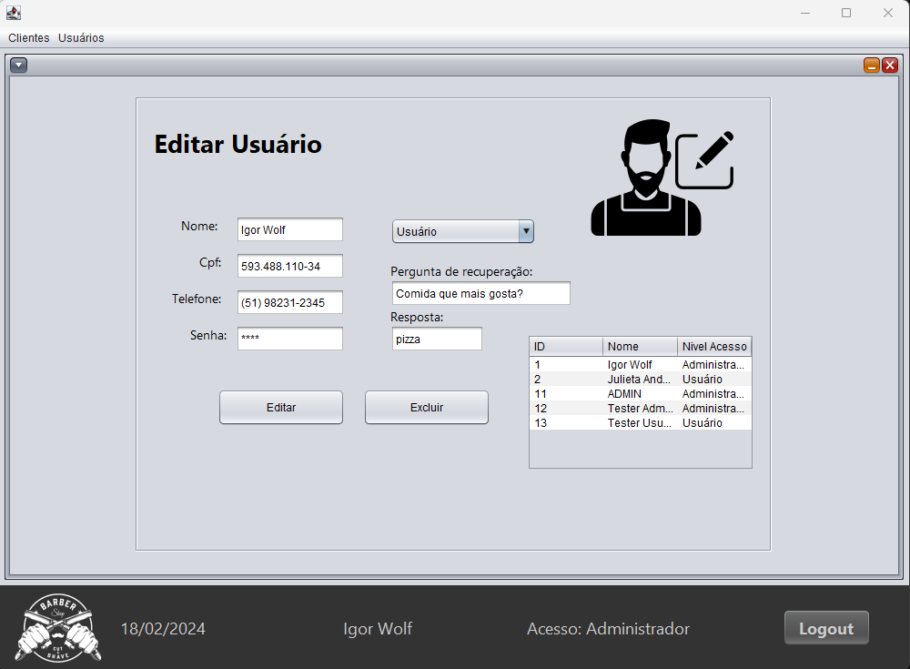
 

# Clonando o Repositório

Para executar este projeto, você precisará ter os seguintes requisitos instalados:
- Java JDK;
- PostgreSQL;
- IDE NetBeans (Opcional);

### Clone o repositório
- git clone git@github.com:IgorWolf99/BarberHub.git

### Entre no diretório do projeto
- cd BarberHub

### Criando o Banco de Dados
- Crie o banco de dados "Barber-Shop" no PostgreSQL.
  
### Usuário/Senha Banco de Dados
Altere os campos de usuário e senha no arquivo persistence.xml:
- property name="javax.persistence.jdbc.user" value="SEU USUARIO DO BANCO" 
- property name="javax.persistence.jdbc.password" value="SUA SENHA DO BANCO"
  
### Executando o Projeto
Execute o comando Java para iniciar o aplicativo a partir do JAR:
- java -jar target/BarberHub-1.0.jar

Ou, execute comando Maven:
- mvn exec:java

Executando na IDE NetBeans
- Abra o projeto na IDE NetBeans.
- No painel "Projetos", clique com o botão direito no projeto.
- Escolha a opção "Run" para executar o projeto.

### Logando no sistema
- Utilize o usuário "ADMIN" senha "admin".
   
---    

# Considerações sobre o Desenvolvimento do Projeto
Esse projeto desenvolvido me proporcionou ampliar os meus conhecimentos sobre ambiente de desenvolvimento de softwares, pois me permitiu por em pratica a parte teorica e também me incentivou a buscar através de pesquisas, maneiras diferentes e mais eficientes de atigir o meu objetivo.   

  
Irei comentar abaixo algumas partes do codigo que achei interessante:  

---

### Design Patterns Singleton
A utilização do padrão Singleton para capturar informações do usuário no início da aplicação, possibilitou a utilização desses dados em várias situações, principalmente onde era necessário informações sobre o usuário logado, isso sem ter a necessidade de ficar criando instancias sempre que essas informações fossem necessarias. Também foi desenvolvido um método de verificação se o usuário é um administrador. Ao utilizar essa verificação, o sistema pode habilitar ou desabilitar determinados recursos, botões e atividades com base no perfil do usuário.

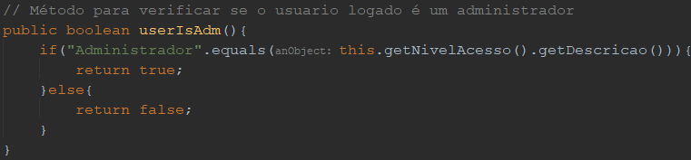 

Utilização dessa classe em um método que deleta os dados do cliente
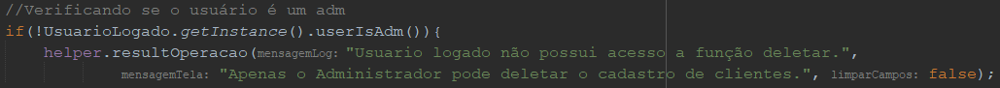

---   

### Helpers  

A implementação de classes Helpers melhorou a organização do código, tornando as funções nas classes de controle mais compreensíveis. 

Um exemplo é o método "converterData", que não apenas converte uma string para o tipo Date, mas também realiza verificações robustas e trata exceções quando necessario. Isso simplificou significativamente o manuseio de variáveis do tipo Date.   
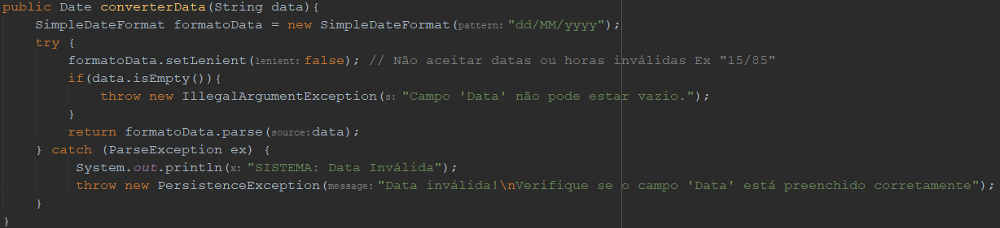   

Outro exemplo é o método "resultOperacao", feito para fornecer mensagens simples de log do sistema e mensagens visíveis na tela. Além disso, por meio de um parâmetro booleano, é possível determinar se a limpeza dos campos na view deve ser realizada.
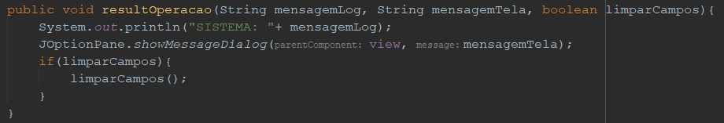  

 
---

### Exclusão dos Agendamentos

A lógica de exclusão de agendamentos também foi feita com o objetivo de evitar a remoção dos agendamentos de outros profissionais. O processo de exclusão utiliza o **ID do agendamento**, que é obtido apenas ao selecionar um agendamento na tabela, sem ser possivel edita-lo. Importante ressaltar que a tabela exibe exclusivamente os agendamentos associados ao profissional atualmente logado.
 Dessa forma, a exclusão é restrita aos agendamentos do profissional logado, garantindo a segurança dos dados. O sistema automaticamente captura o ID correspondente ao escolher um agendamento na tabela, assegurando que apenas os próprios compromissos possam ser removidos ou editados.

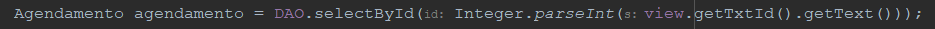

 Essa é uma lógica simples desenvolvida, porém achei interessante compartilhar.

---
 ### PovoarDB

Criei uma classe que roda um script sql que adiciona alguns dados de clientes e serviços ao banco, permitindo que aqueles que clonarem o projeto para testa-lo já tenham acesso a alguns dados no sistema.

